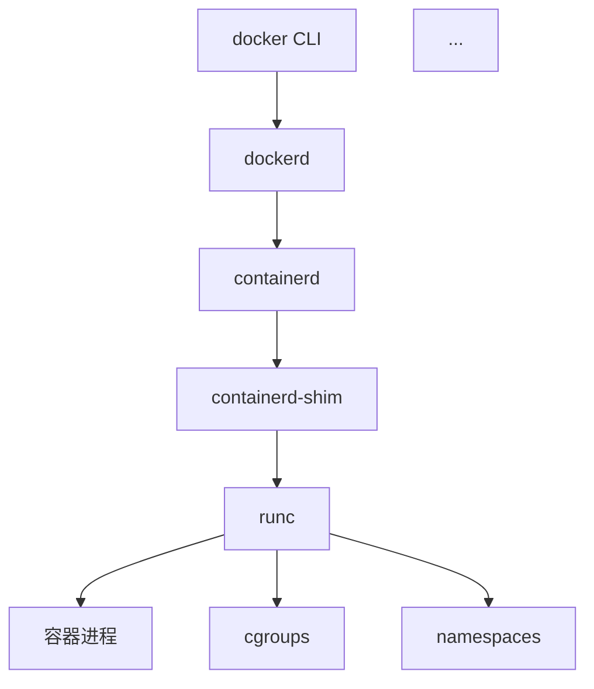

# 🐳 Docker Source Code Learning System

> **An AI-native, multi-agent system that teaches you Docker internals through conversation, quizzes, spaced repetition, and deep research — all powered by a knowledge graph.**

[](https://www.python.org/downloads/)
[](https://opensource.org/licenses/MIT)
[](CONTRIBUTING.md)
[](.)
[](./agents)
[](./docker-knowledge)
[](./web_ui)

---

**🇨🇳 中文说明：** 这是一个智能体原生的 Docker 源码学习系统，整合对话、解题、测验、深度研究、可视化、知识库、间隔重复和长期记忆。点击 [这里](./README.zh.md) 查看中文版。

---

## 📸 Demo

```text
$ python3 learn.py

🐳 Docker 源码学习系统 v1.0
━━━━━━━━━━━━━━━━━━━━━━━━━━━━━━━━━━━━━━━━━━━━━━━━━━━━━━

📚 16个核心概念 | 14道题目 | 8种人格
🎯 学习系统已就绪，开始你的 Docker 源码之旅！

━━━━━━━━━━━━━━━━━━━━━━━━━━━━━━━━━━━━━━━━━━━━━━━━━━━━━━
💡 输入「引导」查看新手教程，或直接开始学习！

> 什么是容器运行时？

🧠 容器运行时 (Container Runtime)
━━━━━━━━━━━━━━━━━━━━━━━━━━━━━━━━━━━━━━

一句话定义：
  负责管理容器完整生命周期的底层软件组件

核心组成：
  • runc    — 实际创建和运行容器进程（OCI 实现）
  • containerd — 高级运行时，管理镜像传输和容器生命周期
  • shim    — 连接 containerd 和 runc 的桥梁

代码路径：
  docker/daemon/ → containerd API → containerd →
  runc create/start

关联概念：
  → cgroups (资源隔离)
  → namespaces (视图隔离)
  → 镜像层 (容器文件系统)

> 画一下容器运行时的架构图

📊 容器运行时架构图
━━━━━━━━━━━━━━━━━━━━━━━━━━━━━━━━━━━━━━



> 考考我关于 cgroups 的题

📝 测验：cgroups
━━━━━━━━━━━━━━━━━━━━━━━━━━━━━━━━━━━━━━

Q1 (选择题):
cgroups 在 Docker 中主要用于什么？

A. 网络隔离
B. 进程视图隔离
C. 资源限制和监控
D. 文件系统隔离

> 你的答案？
```

---

## 🎯 Why This Exists

Learning Docker source code has a steep learning curve:

- **Docker's codebase** is 2M+ lines of Go — where do you even start?
- **Existing tools** are either docs (passive) or tutorials (linear) — none adapt to **you**
- **Learning drops off** without spaced repetition — the brain forgets

**This system solves all three.** It's like having a personal tutor who:

1. 📖 **Knows the codebase** — maps concepts to actual source files
2. 🧠 **Remembers what you know** — adapts difficulty and pace
3. 🔄 **Reviews at the right time** — SM-2 spaced repetition
4. 🎭 **Teaches in your style** — 8 teaching personas (Socratic, Professor, Coach...)
5. 🔍 **Goes deep** — generates research reports with architecture diagrams

---

## ✨ Features

| Feature | Description |
|---------|-------------|
| 💬 **Conversational Tutor** | Ask anything about Docker internals. The system retrieves knowledge graph context, checks your mastery level, and adapts the explanation. |
| 📝 **Quiz Engine** | 8 question types, 5 scoring methods. Difficulty adapts to your mastery. Questions are linked to knowledge graph concepts. |
| 🔄 **Spaced Repetition** | SM-2 algorithm with forgetting curve modeling. Automatically schedules reviews when you're about to forget. |
| 🎭 **8 Teaching Personas** | Socratic, Professor, Practitioner, Storyteller, Coach, Debugger, Minimalist, Devil's Advocate. Switch with a single command. |
| 📊 **Visualization Engine** | 8 diagram types: architecture, call chain, class diagram, data flow, learning path, knowledge graph, progress, heatmap. All Mermaid. |
| 🔬 **Deep Research** | Generates structured research reports (7 sections) with code references, architecture analysis, design patterns, and concept relationships. |
| 📚 **Knowledge Base** | Structured Docker knowledge with 4 categories: basic concepts, source architecture, design decisions, practical tips. |
| 📖 **Interactive Books** | Read chapters with code links, concept annotations, and auto-generated quizzes at chapter end. |
| 📓 **Note System** | Notes auto-link to concepts. Supports semantic search and Markdown export. |
| 🧠 **Long-term Memory** | Cross-session context recovery. Remembers what you learned, weak spots, misconceptions, and preferences. |
| 🎯 **Adaptive Learning Path** | 4 stages (Beginner → Advanced → Proficient → Expert), BFS prerequisite planning, adaptive adjustments. |
| 🖥️ **Dashboard** | Learning overview, mastery distribution, due reviews, 4 learning loops, stats, export, milestones. |
| ❌ **Misconception Detection** | DeepTutor-inspired Expectation-Misconception framework. Catches misunderstandings and corrects them in real-time. |

---

## 🏗️ Architecture

```
┌──────────────────────────────────────────────────────────────────┐
│                        USER INTERFACE                            │
│      ┌──────────────┐  ┌──────────────┐  ┌──────────────┐       │
│      │  Natural      │  │  Visualization │  │  File/Code   │       │
│      │  Language     │  │  Output        │  │  Export      │       │
│      └──────┬───────┘  └──────┬───────┘  └──────┬───────┘       │
└─────────────┼──────────────────┼──────────────────┼──────────────┘
              │                  │                  │
┌─────────────┼──────────────────┼──────────────────┼──────────────┐
│             ▼                  ▼                  ▼              │
│    ┌─────────────────────────────────────────────────────────┐  │
│    │                ORCHESTRATOR LAYER                       │  │
│    │  ┌──────────┐ ┌──────────┐ ┌──────────┐ ┌──────────┐   │  │
│    │  │  Tutor   │ │Researcher│ │QuizMaster│ │Visualizer│   │  │
│    │  │  Agent   │ │  Agent   │ │  Agent   │ │  Agent   │   │  │
│    │  └────┬─────┘ └────┬─────┘ └────┬─────┘ └────┬─────┘   │  │
│    │  ┌────┴─────┐ ┌────┴─────┐ ┌────┴─────┐              │  │
│    │  │  Coach   │ │ Librarian│ │  Scribe  │              │  │  │
│    │  │  Agent   │ │  Agent   │ │  Agent   │              │  │  │
│    │  └──────────┘ └──────────┘ └──────────┘              │  │  │
│    └───────────────────────────┬──────────────────────────┘  │  │
│                               │                              │  │
│    ┌───────────────────────────┼──────────────────────────┐  │  │
│    │            ▼              ▼              ▼            │  │  │
│    │    ┌──────────┐  ┌──────────────┐  ┌──────────────┐  │  │  │
│    │    │Knowledge │  │Long-term     │  │  Tools       │  │  │  │
│    │    │ Graph    │  │Memory (MCP)  │  │(Browser/CLI) │  │  │  │
│    │    │ (File)   │  │ (Vector+File)│  │              │  │  │  │
│    │    └──────────┘  └──────────────┘  └──────────────┘  │  │  │
│    └──────────────────────────────────────────────────────┘  │  │
│                   DATA & INFRASTRUCTURE LAYER                 │
└──────────────────────────────────────────────────────────────┘
```

### Multi-Agent Collaboration

| Agent | Role | Core Capability |
|-------|------|-----------------|
| **Orchestrator** | Scheduler | Intent recognition, context management, Agent routing |
| **Tutor** | Teacher | Concept explanation, knowledge transfer, adaptive teaching |
| **Researcher** | Researcher | Source code analysis, research report generation |
| **QuizMaster** | Examiner | Quiz generation, auto-scoring, difficulty adaptation |
| **Visualizer** | Visualizer | Diagram generation, architecture drawing |
| **Librarian** | Librarian | Knowledge base management, books, notes |
| **Coach** | Coach | Practice planning, spaced repetition, mastery tracking |
| **Scribe** | Scribe | Session recording, note generation, memory updates |

---

## 🚀 Quick Start

### Prerequisites

- Python 3.10+
- pip

### CLI Mode (Zero Dependencies)

```bash
# Clone the repo
git clone https://github.com/yourusername/docker-learn-system.git
cd docker-learn-system

# Run it — no dependencies to install (pure Python)
python3 learn.py
```

That's it. The CLI uses pure Python with no external dependencies. Knowledge graph, quiz engine, mastery model — all built from scratch.

### 🌐 Web UI Mode (Recommended for New Users)

```bash
# Install Streamlit
pip install streamlit

# Launch the web interface
streamlit run web_ui/app.py
```

Then open **http://localhost:8501** in your browser. The Web UI includes:
- 💬 **Chat interface** — talk to the tutor like ChatGPT
- 📊 **Dashboard** — learning overview with charts
- 📚 **Knowledge Graph** — browse all 16 concepts with mastery levels
- 📝 **Quiz** — interactive quiz with scoring and feedback
- 🎯 **Mastery Heatmap** — bar charts and retention curves
- 🔬 **Deep Research** — generate research reports
- 📖 **Books** — read interactive chapters
- 📓 **Notes** — create, search, and export notes
- 🎭 **Persona Switcher** — change teaching style from the sidebar

### First Steps

```text
> 引导                 # New user onboarding
> 总览                 # Learning dashboard overview
> 什么是容器运行时      # Ask about a concept
> 考考我               # Take a quiz
> 画一下架构图         # Visualize the architecture
> 用教授风格           # Switch persona to Professor
> 深入容器运行时       # Deep research mode
> 我的掌握度           # Check mastery levels
```

---

## 🎭 Teaching Personas

```
┌───────────────┬──────────────────────────────────────┐
│   Persona     │  Style                               │
├───────────────┼──────────────────────────────────────┤
│ Socrates      │  Questions back, makes you think     │
│ Professor     │  Structured, rigorous, systematic    │
│ Practitioner  │  Code-first, hands-on                │
│ Storyteller   │  Analogies, narratives, intuitions   │
│ Coach         │  Goal-oriented, motivational         │
│ Debugger      │  Problem-first, reverse thinking     │
│ Minimalist    │  Shortest path to the answer         │
│ Devil's Advocate │ Challenges assumptions            │
└───────────────┴──────────────────────────────────────┘
```

Switch anytime during a session:
```text
> 用教练风格
> 苏格拉底模式
> 这次用极简者的方式
```

---

## 🧩 Knowledge Graph (16 Core Concepts)

```
┌──────────────────────────────────────────────────────────────┐
│                    Docker Knowledge Graph                     │
├──────────────────────────────────────────────────────────────┤
│                                                              │
│  ContainerRuntime ──prerequisite──> cgroups                  │
│  ContainerRuntime ──prerequisite──> namespaces               │
│  ContainerRuntime ──related──> ImageLayer                    │
│  ImageLayer ──prerequisite──> StorageDriver                  │
│  ImageLayer ──related──> Dockerfile                          │
│  NetworkModel ──prerequisite──> BridgeNetwork                │
│  NetworkModel ──prerequisite──> OverlayNetwork               │
│  DockerArchitecture ──calls──> ContainerRuntime              │
│  DockerArchitecture ──calls──> ImageManagement               │
│  ... (16 concepts, 20+ misconceptions)                       │
│                                                              │
└──────────────────────────────────────────────────────────────┘
```

Each concept is pre-loaded with:
- **Definition** & **difficulty rating**
- **Prerequisites** & **related concepts**
- **Source code references** (file paths)
- **Common misconceptions** (DeepTutor Expectation-Misconception framework)

---

## 🧠 Spaced Repetition (SM-2)

The mastery engine uses a modified SM-2 algorithm:

```
Mastery Record for "Container Runtime":
  Level:        0.65 (65%)
  Last Review:  2 days ago
  Attempts:     5 (3/5 correct)
  Next Review:  Tomorrow (due!)
  Forgetting Curve: Dropping — review now!
```

- **Forgetting curve**: mastery decays exponentially over time
- **Association propagation**: improving one concept boosts related ones by 30%
- **Due review prediction**: automatically identifies concepts needing review

---

## 🗺️ Project Structure

```
docker-learn-system/
├── README.md              ← This file
├── README.zh.md           ← Chinese version
├── ARCHITECTURE.md        ← Technical architecture deep-dive
├── ROADMAP.md             ← Implementation roadmap (P0-P7)
├── OVERVIEW.md            ← File structure overview
│
├── learn.py               ← CLI entry point (37 lines!)
├── engine/                ← Core engine (6,300+ lines)
│   ├── orchestrator.py    ← Main orchestrator (1,800+ lines)
│   ├── knowledge_graph.py ← Knowledge graph engine (415 lines)
│   ├── knowledge_base.py  ← Knowledge base + books + notes (333 lines)
│   ├── quiz_engine.py     ← Quiz & scoring engine (698 lines)
│   ├── mastery_engine.py  ← SM-2 mastery engine (601 lines)
│   ├── visualization_engine.py ← 8 diagram types (620 lines)
│   ├── research_engine.py ← Deep research reports (400 lines)
│   ├── memory_engine.py   ← Long-term memory (750 lines)
│   ├── persona_engine.py  ← 8 personas + learning path (950 lines)
│   └── dashboard_engine.py ← Dashboard + flows + UX (512 lines)
│
├── agents/                ← Agent role definitions (5 agents)
├── docker-knowledge/      ← Knowledge graph seed data
│   └── CONCEPTS.md        ← 16 concepts with misconceptions
├── questions/             ← Question bank
│   └── EXAMPLES.md        ← 14 questions, 8 types, 5 difficulties
├── personas/              ← Persona configurations
│   └── ALL_PERSONAS.md    ← 8 persona presets
├── books/                 ← Interactive book content
│   └── docker-shenjiu/    ← "Deep Dive into Docker" book
├── notes/                 ← User notes (generated at runtime)
├── memory/                ← Learning memory (generated at runtime)
└── deploy/                ← Docker deployment
    ├── docker-compose.yml ← Full stack (Neo4j + ChromaDB + App)
    ├── Dockerfile         ← Container build
    └── Makefile           ← Build & deploy commands
```

---

## 📊 Stats

| Metric | Value |
|--------|-------|
| Python code lines | ~6,300 |
| Engine modules | 10 |
| Agent roles | 8 |
| Core concepts | 16 |
| Common misconceptions | 20 |
| Questions | 14 (8 types, 5 difficulties) |
| Teaching personas | 8 |
| Visualization types | 8 |
| Quiz scoring methods | 5 |
| Learning loops | 4 |
| Docker deployment files | 7 |

---

## 🛠️ Tech Stack

| Layer | Technology |
|-------|-----------|
| **Language** | Python 3.10+ (pure, no external deps) |
| **Knowledge Graph** | File-based (engine supports Neo4j switch) |
| **Memory** | File system + JSON (vector DB ready) |
| **Visualization** | Mermaid diagrams |
| **CLI** | Native terminal (no framework) |
| **Deployment** | Docker Compose (Neo4j + ChromaDB + App) |

---

## 🎯 Implementation Status

All 7 phases completed:

| Phase | Name | Status |
|-------|------|--------|
| P0 | Foundation + Knowledge Graph + Dialogue | ✅ |
| P1 | Knowledge Base + Books + Notes | ✅ |
| P2 | Quiz Engine + Scoring | ✅ |
| P3 | Mastery Model + Spaced Repetition | ✅ |
| P4 | Deep Research + Visualization | ✅ |
| P5 | Long-term Memory + Context Recovery | ✅ |
| P6 | Persona System + Adaptive Learning Path | ✅ |
| P7 | Dashboard + Learning Loops + UX | ✅ |

---

## 🤝 Contributing

This is a project that could go many directions. Contributions welcome!

**Ideas to explore:**
- 🌐 **Web UI** (Streamlit / React frontend) — would 3x the stars
- 🔬 **Real Go AST parsing** — connect to actual Docker source code
- 🗄️ **Neo4j backend** — for large-scale knowledge graphs
- 🌍 **English content** — translate concepts and questions
- 🧪 **More questions** — expand the question bank
- 🎨 **More visualizations** — add new diagram types
- 📱 **API mode** — expose as a service

---

## 📜 License

MIT License. See [LICENSE](LICENSE) for details.

---

## 🙏 Acknowledgments

- Inspired by [DeepTutor](http://deeptutor.memphis.edu/) — the Expectation-Misconception framework
- Built on research in spaced repetition (SM-2 algorithm)
- Docker knowledge based on the actual Docker CE source code

---

**⭐ If you find this project useful, give it a star! It helps others discover it.**